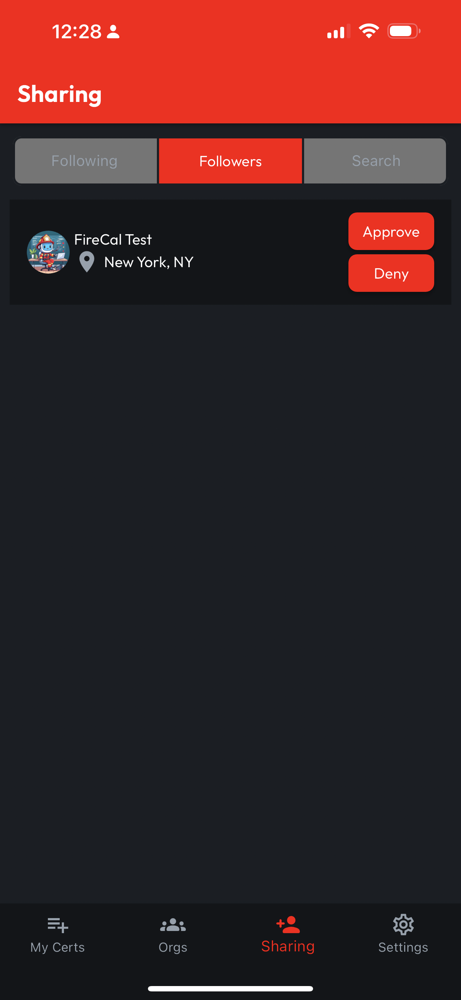
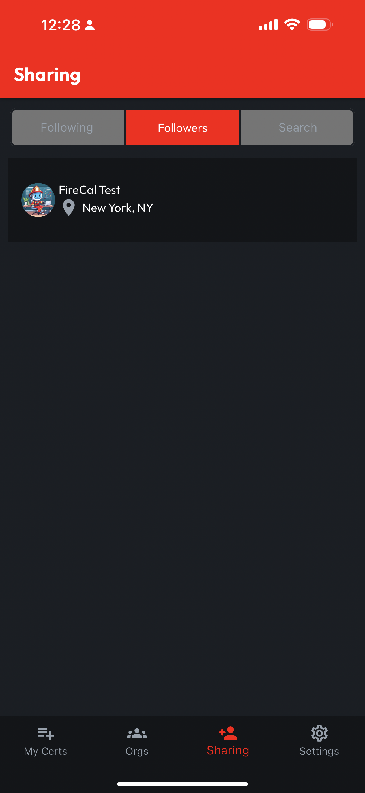

# Manage Followers List

## Open the Sharing Tab

Access the Followers List from the Sharing Tab, where both Approved and Pending Followers will appear.

<figure><figcaption></figcaption></figure>

 

<figure><figcaption></figcaption></figure>

## Approve or Deny Followers

From the Followers List, Follow Requests can be Approved or Denied. Approving a Follow allows the Follower to access your Profile and Certs according to your Sharing Preferences. Denying a Follower will remove them from your Followers List and remove you from their Following List.

Note: If your Sharing Preferences for your My Certs page are set to Public, any Certs you haven't marked Private will still be viewable.
