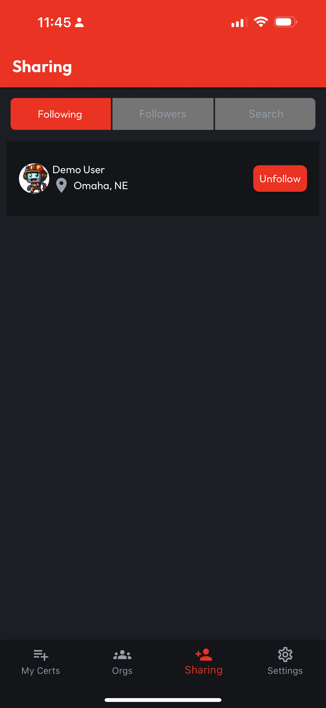

# Manage Following List

## Navigate to the Sharing Tab

Under **Sharing**, the default view is **Following**. The **Following Tab** allows navigation to **User Profiles** by tapping on the **List Item** for a given **User**. To **Unfollow** a user in the list, simply **tap** the **Unfollow** button for the given **User**, and they will be removed from the **Following List**.

<figure><figcaption></figcaption></figure>
