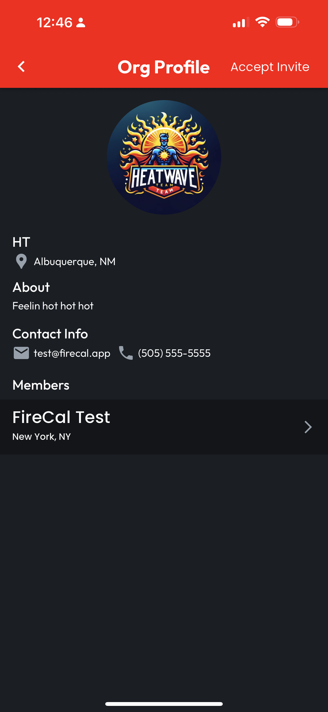
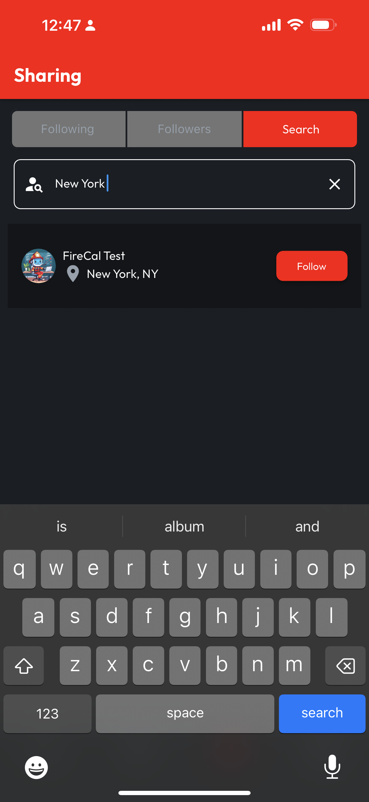
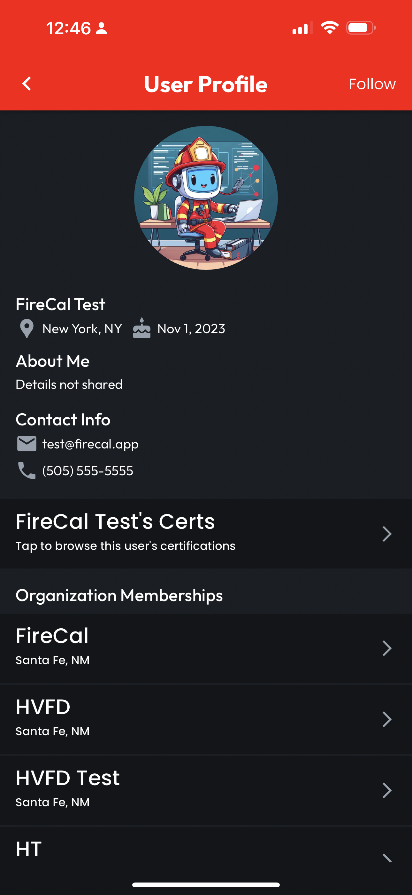

# Viewing User Profiles

## Navigating to User Profiles

User Profiles can be accessed from anywhere you see a list of Users, simply by tapping on the User List Item.&#x20;

<figure><figcaption></figcaption></figure>

 

<figure><figcaption></figcaption></figure>

* **Sharing > Search Results** - From the Sharing navbar item, select the Search tab and perform a search. Each result can be tapped to navigate to the resulting user's Profile.
* **Sharing > Following** - From the Sharing navbar item, select the Following tab and tap on any user in the list to view their Profile.
* **Sharing > Followers** - From the Sharing navbar item, select the Followers tab and tap on any user in the list to view their Profile.
* **Orgs > Members** - From the Orgs navbar item, tap on any Org listed on the My Orgs, Invites, or Requests tabs, or perform an Org Search on the Search tab, then tap one of the results. On the Org Profile page, the Members List Items are tappable and will navigate to the listed user's Profile.

## User Profile Elements

User Profiles include details about the User, as well as a button in the top right to Follow or Unfollow, depending on the existing relationship to the User being viewed.

User Certs & Organization Memberships

Based on the user's Sharing Preferences, their Profile might include a link to view their Certs.

On the User Profile, Organization Memberships are browsable, with each Organization List Item being tappable to access the Organization Profile, and even Request to Join, if appropriate.

<figure><figcaption></figcaption></figure>
