# Create a Training Record

## Tap + to Create

To Create a new Training Record, navigate to the Training navbar item at the bottom, and from either the Upcoming or History tab, tap the + (FAB) button at the bottom right.

<figure><figcaption></figcaption></figure> <figure><figcaption></figcaption></figure>

## Enter Training Details

This will take you to the Create Training screen, where you can fill in your training details, like the Title, Description, Category, Location, etc.


Important: A few things will change depending on whether you're scheduling a training for future, or logging a training that already occurred.


The Training Duration indicates how long the training lasted, while the Units Earned will set how many CE credits this training earns attendees, which are typically measured in hours, though some Cert Types use other units.

<figure><figcaption></figcaption></figure> <figure><figcaption></figcaption></figure>

## Apply Training to Certs CEs

Some fields are expandable and include an Add button, like the Applicable Certs section, where the Add button will call up a search screen to find Applicable Cert Types for your training, to ensure your Attendees get credit for CEs from this training.

Tap Add, then use the Search bar to find the Cert Types this Training applies to. When you've added all the Cert Types you need, tap Done.

<figure>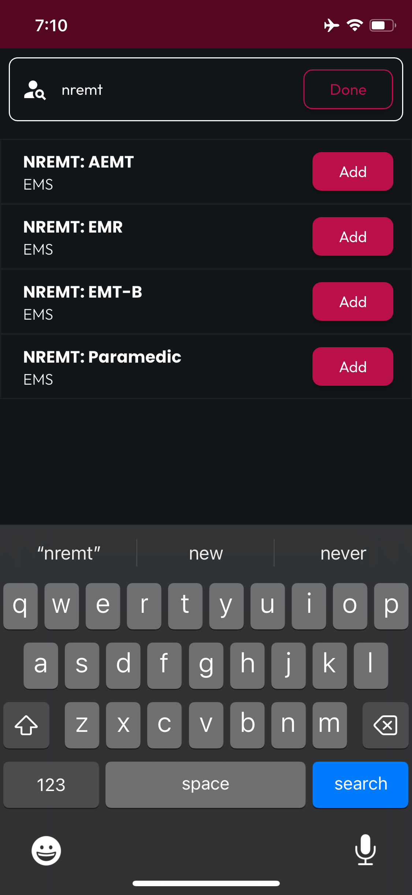<figcaption></figcaption></figure> <figure>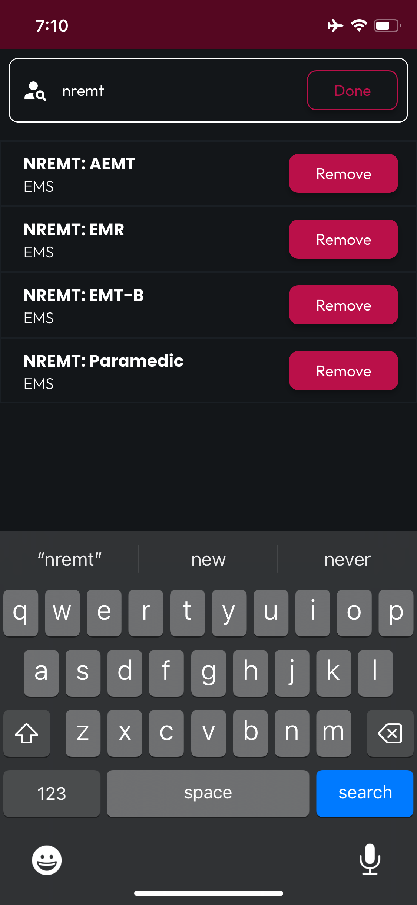<figcaption></figcaption></figure>

For Cert Types with defined Requirements, you'll be presented with a followup screen, where you can select which Requirement this Training applies to for each selected Cert Type.

<figure>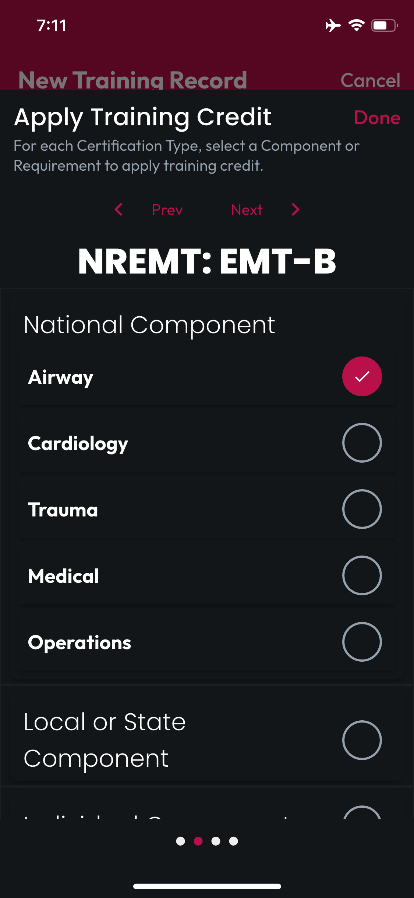<figcaption></figcaption></figure> <figure>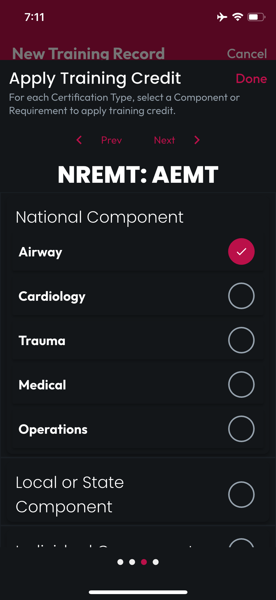<figcaption></figcaption></figure> <figure>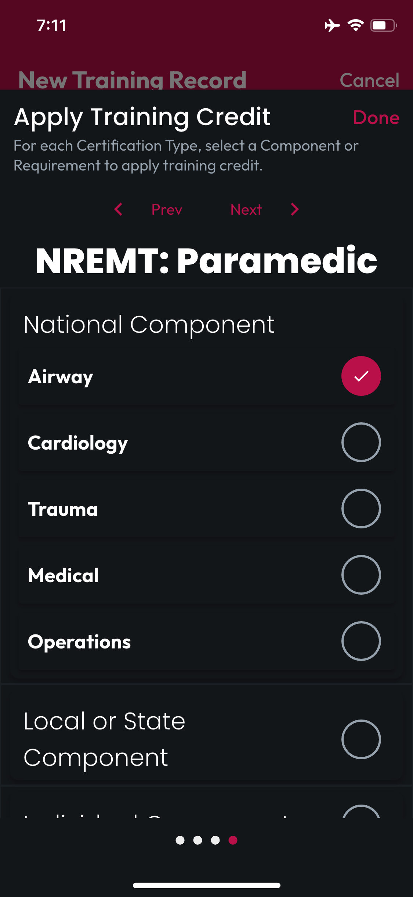<figcaption></figcaption></figure>

When you've selected the Requirements for each Cert Type, tap Done, and you'll see each Cert Type and their selected Requirement listed.

<figure>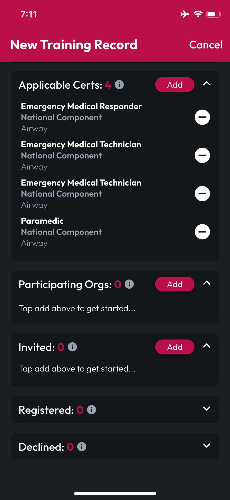<figcaption></figcaption></figure>

## Inviting Orgs & Users

Similarly, the Participating Orgs, Invited, and Attended sections have Add buttons to find Orgs and Users that will be Invited to a future training or logged as Attended in a Concluded training. In this Search UI, you can Find and Add as many Users or Orgs as you need, then tap Done.

<figure>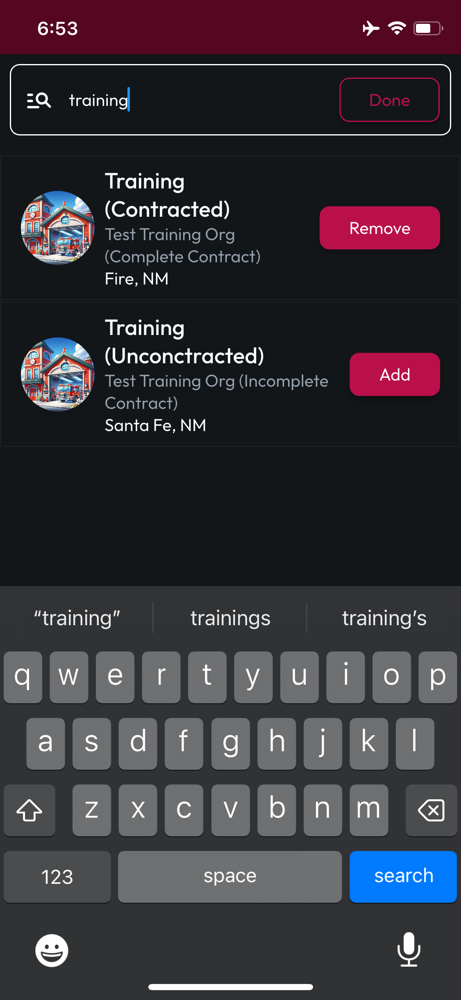<figcaption></figcaption></figure> <figure><figcaption></figcaption></figure> <figure>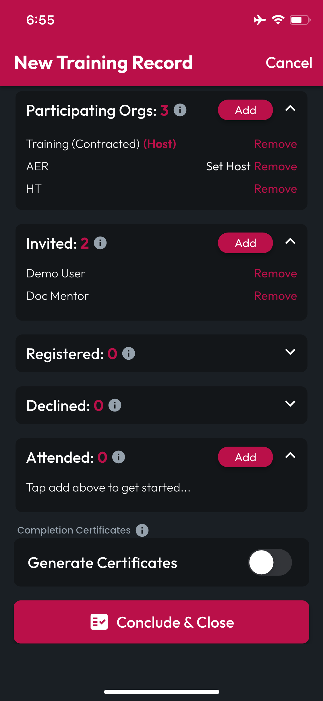<figcaption></figcaption></figure>

Added Orgs & Users can be removed from the Create Training screen, and for Orgs where you are an Admin, you can Set Host, indicating this Org hosted the event.


For features requiring a Department Tier contract, such as Training Certificate Generation, CertLocker will enable or disable those features based on whether the Host Org has a subscription with the required options enabled.


## Generating Training Certificates

Finally, if you've set a Host Org with a Department Tier contract that includes Generating Training Certificates, you'll be able to toggle on the Generate Certificates switch. This will reveal the Certificate Signature Settings, where you can view your Host Org's Default Certificate Signature.

If you'd like to replace the Default Signature with a signature by the Training Provider, you can expand this section, sign in the provided UI, then tap Save. If you'd like to revert to the Default, simply tap the circular arrow in the bottom right corner of the signing UI.

<figure><figcaption></figcaption></figure> <figure>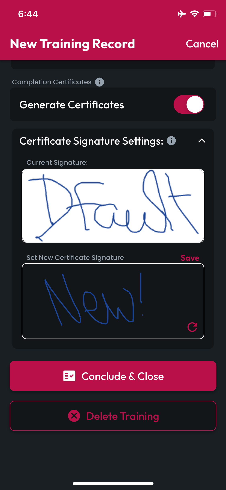<figcaption></figcaption></figure> <figure>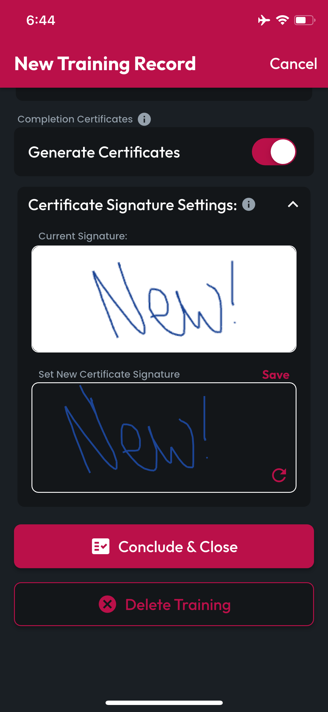<figcaption></figcaption></figure>

## Important Before Concluding

### Logging Attendance

For Trainings that have already concluded, be sure to complete your Training's Attended list before tapping Conclude & Close, as this button will take several actions on behalf of confirmed Attendees, including Generating Training Certificates, and applying any training credit to selected Applicable Certs and their Requirements.

### Required Fields

Some fields are required to properly save a new training, so be sure to check empty fields for indicators of their necessity, if the Conclude & Close or Create Training buttons don't succeed.

### Create vs Conclude

Note the difference between the Conclude & Close vs Create Training buttons below, which appear when appropriate, depending on whether the training has already occurred or will occur in the future. If you're seeing the wrong button, double check the Date and Time set for your Training.


These buttons execute different actions to fit the context, for example Create Training will send Invites for a future Training, while Conclude will not. Similarly, Conclude will Generate Certificates for listed Attendees as soon as you tap it, while Create Training will not.


<figure><figcaption>
"Conclude &#x26; Close" Past Trainings
</figcaption></figure> <figure><figcaption>
"Create Training" for Future Trainings
</figcaption></figure>

## Training Added

After you've created your Training Record, you'll be taken to the Training screen, where it will appear in the Upcoming or History tab.

<figure>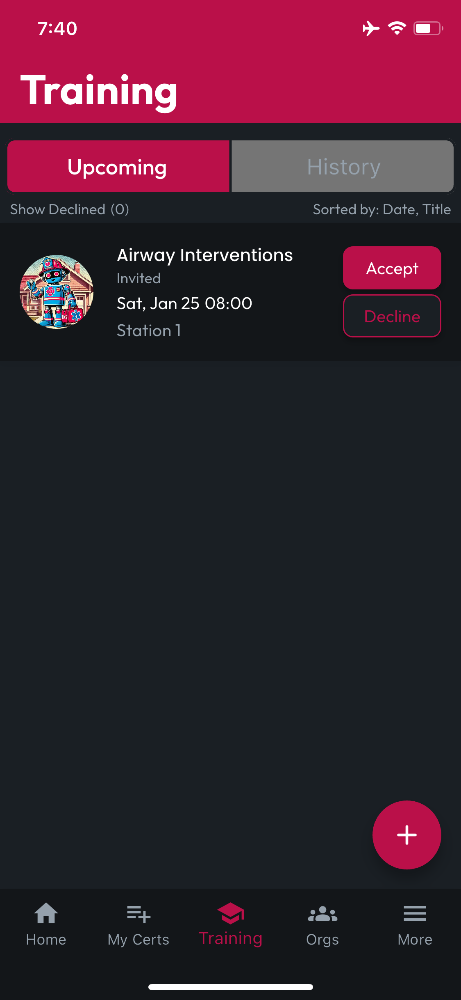<figcaption></figcaption></figure>
