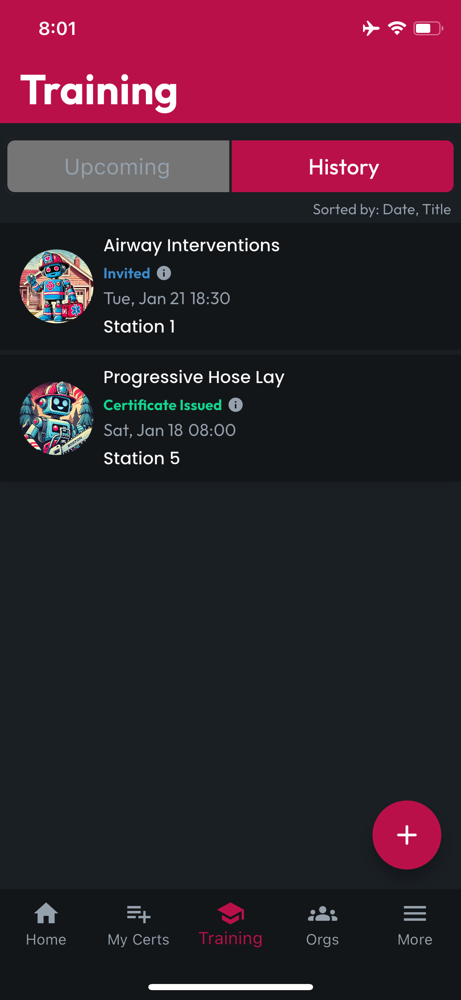

# Training History

The History tab displays a list of Trainings in the past, where you engaged; whether by receiving an Invite, Registering via the Training screen of an Org where you are a Member, or being logged as an Attendee by the Training Creator.

Tap a Training in the list to see more details and view and download your earned Certificate.

<figure><figcaption></figcaption></figure>


Your status can be any of the following:

**Invited:** You received an invitation, but neither registered nor declined

**Registered:** You registered for this event, but your attendance has not yet been confirmed by the training creator

**Declined:** You declined to attend this training

**Attendance Confirmed:** Your attendance has been confirmed by the training creator, but the training has not yet been marked as Concluded

**Completed Training:** Your attendance has been confirmed by the training creator, and the training has been marked as Concluded (no certificates were generated)

**Certificates Issued:** Your attendance has been confirmed by the training creator, the training has been marked as Concluded, and you've been issued a certificate


