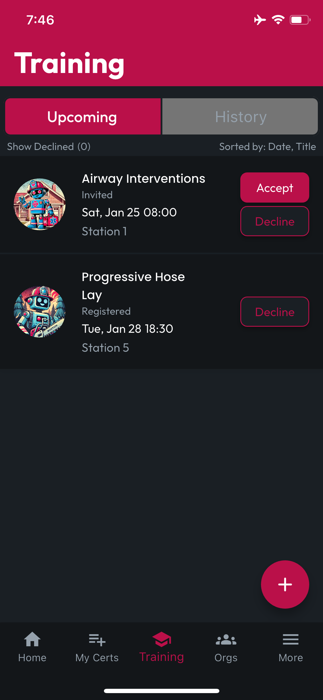
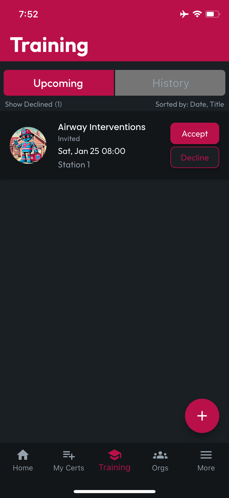
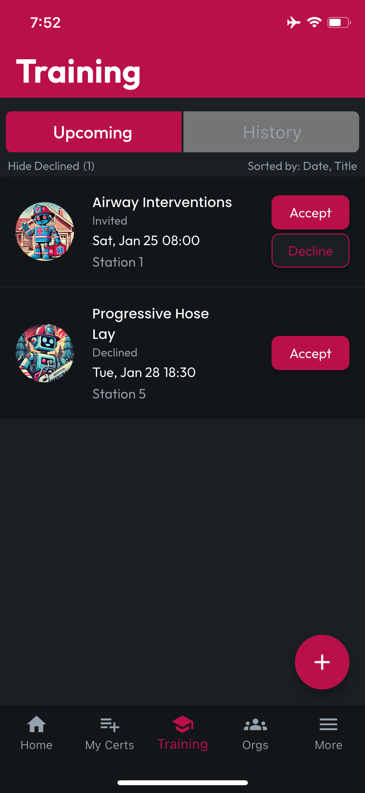

# Upcoming Training

The Upcoming tab displays a list of Trainings scheduled for a future date, where you've engaged; whether by receiving an Invite or Registering via the Training screen of an Org where you are a Member. Tap a Training in the list to see more details. You can also Accept and Decline Invites or tap Decline to Unregister from a Training directly on this screen.

<figure><figcaption></figcaption></figure>

If you Declined an event you'd now like to attend, tap the Show Declined text at the top of the list, and you'll see Declined events.

<figure><figcaption></figcaption></figure> <figure><figcaption></figcaption></figure>

