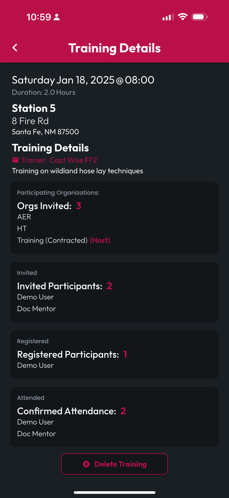

# View a Training Record

Users accessing a Concluded Training Record and any Users accessing a Training Record they did not create will be routed to the View Training screen. Here you can see details about the training, and you can access your Training Certificate via the PDF button next to **My Status**. To contact the Training Provider, tap their name under Training Details, and if their email address was included in the Training Record, an email will be generated to their address using your system default email client.


When viewed by the creator of a training, CertLocker will offer them the option to Delete Training, which will remove the Training Record for all engaged users and delete all Generated Certificates.


<figure><figcaption></figcaption></figure> <figure><figcaption></figcaption></figure>

